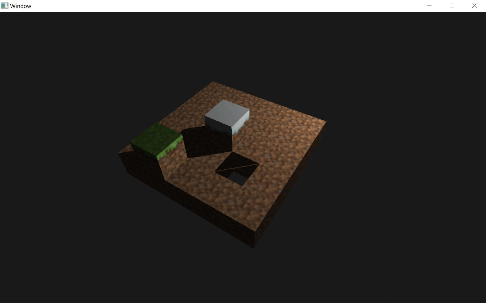

# MyCraft

<p align="center">
  
</p>

## Introduction
Welcome to MyCraft, a "Hello World" to the gaming industry and a personal tribute to the iconic game that marked many of our childhoods, Minecraft. MyCraft is more than just a game; it's a journey back in time and a challenge to myself. By recreating the essence of Minecraft using modern technologies like SDL2 and OpenGL in C++, I aim to both honor my passion for gaming and push my skills to new heights. This project serves as a canvas for learning, experimentation, and homage to the creativity that Minecraft inspired in us all.

## Features
As of now, MyCraft is in its infancy, focusing on laying down the core gameplay elements that make Minecraft so engaging:
- Basic block creation and destruction
- Simple world generation
- Basic player movement and interaction
- Phong lighting and shadow for more realistic environments

While the feature list is modest at the moment, the foundation is set for future expansions, including more complex game mechanics and immersive environmental effects.

## Technologies
MyCraft is built using a combination of powerful tools and libraries, chosen for their robustness and flexibility:
- **SDL2**: Used for the media layer, handling window management, and events.
- **OpenGL4**: Powers the game's graphics rendering, bringing the world of MyCraft to life.
- **SDL Image Library**: Assists in loading textures, crucial for the game's visual aspects.
- **GLM**: Provides the mathematical functions necessary for graphics operations.
- **RapidJSON**: Facilitates serialization of the game world into JSON files for easy saving and loading.
- **Entity-Component System**: A design pattern learned from the "Build Game Engine" course, enabling efficient and flexible game entity management.

## TODO Lists

### In-progress

- [ ] Represent objects in a grid-like data structure for adding and deleting objects
- [ ] Create objects next to another using ray-caster; Use Linear Algebra to determine which side the new cube should be added to
- [ ] Object destruction mechanism
- [ ] Skybox to the world
- [ ] More advanced graphics (i.e. water)
- [ ] Add Resource Manager based on Texture Manager
- [ ] Use Python UI for creating new objects

### Completed
- [x] Implement Entity-Component System
- [x] Phong Lighting
- [x] Shadow 
- [x] Render cube with textures
- [x] Free Camera
- [x] Loading and saving world
- [x] Ray caster that draw an object in wireframe mode
- [x] Texture Manager for loading and saving pointers to texture
- [x] Refactored components (i.e. transform, texture, shape)
- [x] Create and refactored shader program

## Requirements
To run MyCraft, you'll need:
- A system capable of running SDL2 and OpenGL4.
- C++ development environment set up with GCC/Clang or MSVC.
- SDL2, SDL Image, GLM, and RapidJSON libraries installed.

## Installation and Setup
To Compile the program, simply run the python scripty 'build.py' and run the binary file created.

```python
python3 build.py

./lab
```

## Usage
Camera Control:
    - [W] -> Forward
    - [S] -> Backward
    - [A] -> Move Left
    - [D] -> Move Right

World:
    - [Ctrl] + [S] -> Save world. 

## Future Plans
As I continue my educational journey through the "Computer Graphics Course," I plan to enrich MyCraft with advanced graphics utilities, exploring more complex lighting, shading, and rendering techniques to bring the game closer to its inspiration while carving out its unique identity.


## Acknowledgments
- The original Minecraft game, for being a source of inspiration and creativity.
- The "Build Game Engine" and "Computer Graphics" courses By [Mike Shah](https://mshah.io/) at Northeastern University, for providing the knowledge foundation for this project.
- The "Computer Graphics" by [Dr.Jeffrey Paone](https://inside.mines.edu/~jpaone/) at Colorado School of Mines for introductory into graphics. 

## Contact
For more information, questions, or collaborations, please contact me at reeedhuang@gmail.com.